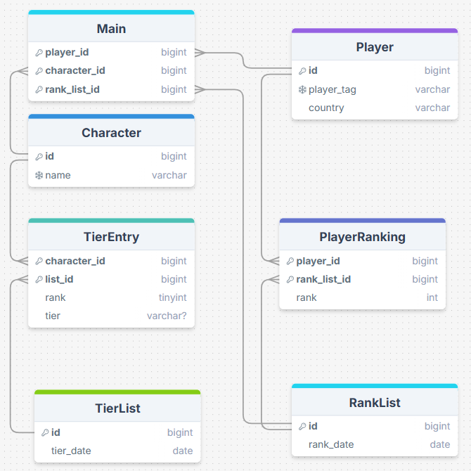

# ERD


# Setup

Create config.json in the base directory and populate it with your OpenAI key

# Successful Query

**Text Question**: "What players have been rank 1?"

**SQL Response**:
```sql
SELECT `Player`.`player_tag` FROM `Player`
JOIN `PlayerRanking` ON `Player`.`id` = `PlayerRanking`.`player_id`
WHERE `PlayerRanking`.`rank` = 1;
```

**Text Response**:
```
Based on the results of your query, the players who have been ranked number 1 are:
- Mango
- Armada
- Hungrybox
- Zain
- Cody Schwab
```

# Failed Query

**Text Question**: "What has Yoshi's lowest ranking been?"

**SQL Response**:
```sql
SELECT MIN(`rank`)
FROM `TierEntry`
JOIN `Character` ON `TierEntry`.`character_id` = `Character`.`id`
WHERE `Character`.`name` = 'Yoshi';
```

**Text Response**:
```
Yoshi's lowest ranking has been 10th.
```

The double-shot actually got this one correct, but the zero-shot gave 10th for both Yoshi's highest and lowest rankings, even though its lowest ranking from the inputted data was 18th. The query was ambiguous as to whether a larger number was a lower or higher ranking, so without specifying this ChatGPT didn't consistently get it right.

# Example questions and responses

[Example QA](exampleQA.json)

# Prompting Strategies

I tried the following prompting strategies:
- Zero-shot Text-to-SQL
- Single-domain Few-shot Text-to-SQL

As illustrated above, double-shot was a little more effective because it provided an example that gave more context. It didn't appear more accurate aside from where the example provided specific clarity for ambiguous cases.

_Note: I modified db_bot.py, its original version is [here](https://github.com/byu-cs-452/byu-cs-452-class-content/blob/main/aisql/db_bot.py)._